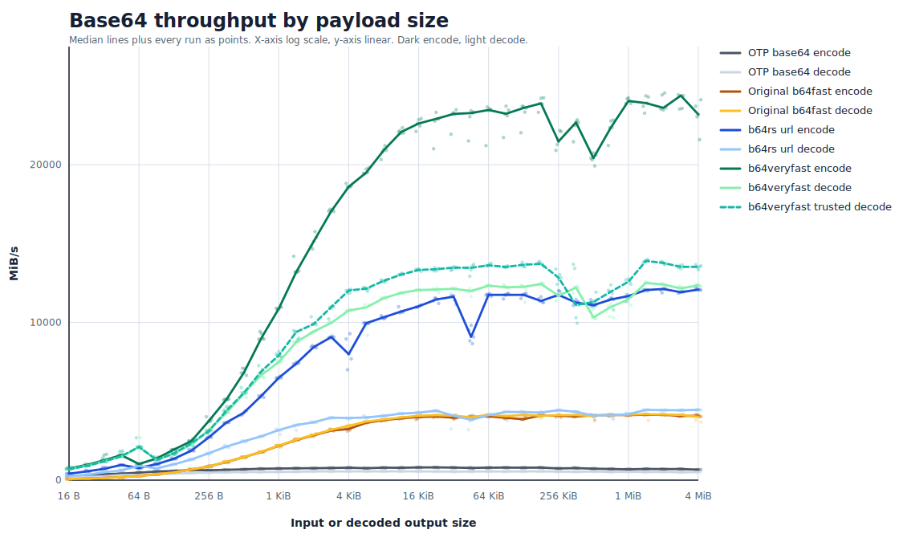

# b64veryfast

`b64veryfast` is a high-throughput Base64 and Base64url encoding/decoding
library for Erlang binaries.

It is a thin, binary-only Erlang NIF over the SIMD-oriented
[`aklomp/base64`](https://github.com/aklomp/base64) C backend. The NIF receives
Erlang input binaries without copying, allocates the exact output binary once,
writes directly into that new binary, and schedules large calls on dirty CPU
schedulers. URL-safe operations are handled inside the backend rather than by
post-processing in Erlang.

In the benchmark environment documented in the Benchmarks section, peak median
throughput is `24.4 GiB/s` encode, `12.8 GiB/s` checked, and `14.2 GiB/s`
for unchecked (no input range checking, etc.) decode.

This project is forked from
[`zuckschwerdt/b64fast`](https://github.com/zuckschwerdt/b64fast). Credit to
that project for the original Erlang project shape and NIF package. The execution
backend is based on [`aklomp/base64`](https://github.com/aklomp/base64), with
credit to its authors and contributors for the high-performance Base64 codecs.

## Why It Is `VeryFast`™️

- `aklomp/base64` provides architecture-specific SIMD codecs, including NEON on
  Apple arm64 and AVX/SSE families on x86.
- The NIF reads the input binary in place, computes the exact output size, and
  writes directly into one newly allocated Erlang binary.
- URL-safe encoding and decoding are handled by the C backend, avoiding an
  Erlang post-processing pass for `+`/`/`/`=` translation.
- Large payloads are scheduled on dirty CPU schedulers so long-running native
  work does not occupy normal BEAM schedulers.
- Unchecked decode variants can skip per-block alphabet classification when a
  caller has already guaranteed valid input.

## Benchmarks



These benchmarks measure end-to-end Erlang calls: NIF boundary crossing, input
inspection, output allocation, and codec execution. They are not raw C
kernel-only numbers.

The sweep uses 185 approximately log-spaced payload sizes from 16 B to 16 MiB.
Each payload size has five runs over the same random binary. The graph uses a
logarithmic x-axis for payload size and a linear y-axis for throughput. Points
are individual runs; lines are per-size medians. Dark marks are encode, lighter
marks are decode, crimson marks are `b64veryfast`, and the dashed crimson line
is `decode64_unchecked/1`.

The benchmark warms and calibrates each operation/payload-size pair, choosing an
iteration count intended to keep each measured run above timer-noise scale. It
then forces Erlang garbage collection before each measured run. It does not pin
schedulers, isolate cores, or disable other host activity, so scatter in the
points is expected.

The mixed full-sweep graph can show a mid-size throughput depression around the
sub-MiB to few-MiB range. That is not a deterministic codec boundary: isolated
boundary sweeps of the same compiled NIF stay flat through this region. The
effect is caused by dirty-scheduler dispatch and Erlang allocator state.

### Selected Results

Median throughput, MiB/s, rounded to the nearest MiB/s. The full precision
values are in the summary CSV.

Encode (`MiB/s`):

| Library | 32 B | 512 B | 4 KiB | 64 KiB | 1 MiB | 4 MiB | 16 MiB |
|---|---:|---:|---:|---:|---:|---:|---:|
| OTP `base64` | 395 | 664 | 777 | 804 | 717 | 646 | 637 |
| Original `b64fast` | 141 | 1,364 | 3,349 | 4,006 | 3,329 | 3,580 | 4,173 |
| `b64rs` URL-safe | 762 | 4,350 | 9,180 | 12,100 | 6,893 | 8,155 | 12,152 |
| **`b64veryfast`** | **1,750** | **6,503** | **17,934** | **24,613** | **10,421** | **12,568** | **24,233** |

Decode (`MiB/s`):

| Library | 32 B | 512 B | 4 KiB | 64 KiB | 1 MiB | 4 MiB | 16 MiB |
|---|---:|---:|---:|---:|---:|---:|---:|
| OTP `base64` | 286 | 520 | 556 | 564 | 520 | 481 | 512 |
| Original `b64fast` | 140 | 1,416 | 3,347 | 4,414 | 3,410 | 3,554 | 4,185 |
| `b64rs` URL-safe | 525 | 2,399 | 3,930 | 4,372 | 3,519 | 3,864 | 4,481 |
| **`b64veryfast`** | **1,264** | **5,125** | **10,468** | **12,933** | **7,850** | **8,281** | **12,441** |
| **`b64veryfast`** (unchecked) | **1,288** | **5,449** | **11,591** | **14,437** | **8,352** | **8,547** | **13,705** |

At the largest measured payload, `b64veryfast` measures `24233 MiB/s` encode
and `12441 MiB/s` checked decode. `decode64_unchecked/1` measures `13705 MiB/s`,
about 1.1x faster than checked decode at that size.

The `_url` variants follow the same performance profile as the standard
Base64 variants. The full URL-safe measurements are included in the raw and
summary CSV files.

## API

All functions accept and return binaries. Non-binary input raises `badarg`.
Checked decode rejects malformed Base64 or Base64url input by raising
`badarg`; functions do not return `{ok, Binary}` or `{error, Reason}` tuples.
Unchecked decode is for known-good input only.

```erlang
b64veryfast:encode64(Bin).         % standard padded Base64
b64veryfast:decode64(Bin).         % standard Base64 decode
b64veryfast:decode64_unchecked(Bin). % unchecked standard Base64 decode
b64veryfast:encode64_url(Bin).     % URL-safe Base64 without padding
b64veryfast:decode64_url(Bin).     % URL-safe Base64 decode
b64veryfast:decode64_url_unchecked(Bin). % unchecked URL-safe Base64 decode
```

Unchecked decode is not a validator. Use it only for Base64 produced by code you
trust, or for input that has already been validated elsewhere. Malformed input
has garbage-in, garbage-out semantics: it may decode to unspecified bytes, and
some malformed tails may still raise `badarg`. This is not a memory-safety issue
for the NIF.

Example:

```erlang
1> b64veryfast:encode64(<<"zany">>).
<<"emFueQ==">>

2> b64veryfast:encode64_url(<<251, 255>>).
<<"-_8">>

3> b64veryfast:decode64_url(<<"-_8">>).
<<251,255>>
```

## Installation

Add the dependency to `rebar.config`:

```erlang
{deps, [
    {b64veryfast, {git, "https://github.com/permaweb/b64veryfast.git",
        {branch, "master"}}}
]}.
```

Then compile as usual:

```sh
rebar3 compile
```

## Compilation

The build uses the top-level `Makefile` to compile `priv/b64veryfast.so`. By
default it detects the host architecture and enables the fastest compiler flags
accepted by the compiler for that host.

Inspect the selected engine flags with:

```sh
make print-config
```

Each detected engine can be overridden with a `B64_VERYFAST_`-prefixed
environment variable:

| Variable | Purpose |
|---|---|
| `B64_VERYFAST_NEON64_CFLAGS` | arm64 NEON engine flags |
| `B64_VERYFAST_NEON32_CFLAGS` | 32-bit ARM NEON engine flags |
| `B64_VERYFAST_AVX512_CFLAGS` | x86 AVX512 engine flags |
| `B64_VERYFAST_AVX2_CFLAGS` | x86 AVX2 engine flags |
| `B64_VERYFAST_AVX_CFLAGS` | x86 AVX engine flags |
| `B64_VERYFAST_SSE42_CFLAGS` | x86 SSE4.2 engine flags |
| `B64_VERYFAST_SSE41_CFLAGS` | x86 SSE4.1 engine flags |
| `B64_VERYFAST_SSSE3_CFLAGS` | x86 SSSE3 engine flags |
| `B64_VERYFAST_DIRTY_THRESHOLD` | byte threshold for dirty CPU scheduler dispatch |
| `B64_VERYFAST_CFLAGS` | additional common C compiler flags |
| `B64_VERYFAST_LDFLAGS` | additional shared-library linker flags |

If an engine variable is present, its value is used exactly. Set it to an empty
value to disable that engine:

```sh
B64_VERYFAST_NEON64_CFLAGS= rebar3 compile
```

Examples:

```sh
B64_VERYFAST_NEON64_CFLAGS="-mcpu=native" rebar3 compile
B64_VERYFAST_AVX2_CFLAGS="-mavx2" rebar3 compile
B64_VERYFAST_DIRTY_THRESHOLD=1048576 rebar3 compile
B64_VERYFAST_CFLAGS="-O3 -DNDEBUG" rebar3 compile
```

Flags such as `-mcpu=native` and `-march=native` optimize for the build host.
They are appropriate for local deployment on the same CPU family, but may not
be suitable for release artifacts that will be moved to older or different
machines.

On x86, `aklomp/base64` can compile multiple engines and choose among them at
runtime. On ARM, the build enables the relevant NEON engine at compile time when
the compiler accepts the selected flags.

### Cross-compilation

Engine selection defaults to the build host's architecture (`uname -m`). To
build for a different target — for example an Android `arm64-v8a` image built on
an x86-64 host — point `CC` at the cross-compiler and set `TARGET_ARCH` to the
target architecture:

```sh
CC=aarch64-linux-android21-clang TARGET_ARCH=aarch64 rebar3 compile
```

`TARGET_ARCH` drives engine selection alone, so this enables the NEON64 engine
and skips the x86 engines with no per-engine overrides. Because `-mcpu=native`
and `-march=native` are meaningless across hosts, native tuning is suppressed
automatically when `TARGET_ARCH` differs from the build host, and each engine
falls back to its portable baseline flag (`-march=armv8-a` for arm64). Override
the engine flags with the `B64_VERYFAST_*` variables above if the target needs a
specific micro-architecture, and set `ERL_INCLUDE` to the target runtime's
`erl_nif.h` directory. A non-Linux build host targeting Linux or Android should
also set `SO_LDFLAGS=-shared` so the output is an ELF shared object.

The generated `c_src/aklomp/lib/config.h` records which engines were enabled
for a build. It is a build artifact and is removed by `make clean`.

## Architecture

`b64veryfast` has three layers:

| Layer | Role |
|---|---|
| `src/b64veryfast.erl` | Public Erlang module and NIF loader |
| `c_src/b64veryfast.c` | Erlang NIF boundary, memory handling, scheduling, flag selection |
| `c_src/aklomp/` | Vendored `aklomp/base64` codec backend |

The NIF boundary is intentionally small:

1. Validate that input is a binary.
2. Inspect the input with `enif_inspect_binary`.
3. Ask the backend for the exact output size.
4. Allocate the output with `enif_make_new_binary`.
5. Pass the input pointer and output pointer to `aklomp/base64`.

This means the hot path avoids avoidable copies:

- The input is read from Erlang-owned binary memory and is never mutated.
- The output is a freshly allocated Erlang binary, so C writes only into memory it has just received for that purpose.
- There is no Erlang-level post-processing pass for URL-safe output.

Large calls are scheduled on dirty CPU schedulers at 2 MiB and above by
default. Small calls run on normal schedulers to avoid dirty scheduler overhead.
This threshold follows Erlang/OTP's practical rule that ordinary NIF calls
should complete in about 1 ms or less. On the benchmark host, even a generic
non-NEON build decoded 1 MiB in roughly 234 us, so 2 MiB leaves headroom while
avoiding the throughput notch caused by moving medium-size payloads to dirty
schedulers too early. Dirty NIFs still consume dirty CPU schedulers and memory
bandwidth, so high-concurrency large-payload workloads should be capacity-tested
under realistic load. Override the cutoff with `B64_VERYFAST_DIRTY_THRESHOLD`
when a target host needs a more conservative or more aggressive pivot.

The vendored backend carries URL-safe and no-padding flags used by the `_url`
functions. Decode functions accept padded or unpadded input for their
respective alphabets, preserving useful original `b64fast` compatibility.
Decoding does not ignore whitespace.

| Function family | Alphabet | Encode padding | Decode padding | Whitespace |
|---|---|---|---|---|
| `encode64/1`, `decode64/1` | Standard `+` and `/` | Emits `=` | Accepts padded or unpadded | Rejected |
| `encode64_url/1`, `decode64_url/1` | URL-safe `-` and `_` | Omits `=` | Accepts padded or unpadded | Rejected |

The unchecked decode functions use the same memory discipline as checked decode.
They read the inspected Erlang binary, allocate one new Erlang output binary,
and write only into that output. The difference is the backend flag:
`decode64_unchecked/1` and `decode64_url_unchecked/1` skip per-block alphabet
classification in the SIMD and scalar hot loops. Use them only when another
layer has already guaranteed that the input is valid Base64 or Base64url.

## Reproducing The Benchmarks

Compile this library:

```sh
rebar3 compile
```

Build optional comparison libraries:

```sh
rm -rf /private/tmp/b64fast-original
git clone --depth 1 https://github.com/zuckschwerdt/b64fast.git /private/tmp/b64fast-original
(cd /private/tmp/b64fast-original && rebar3 compile)

rm -rf /private/tmp/b64rs
git clone https://github.com/permaweb/b64rs.git /private/tmp/b64rs
(cd /private/tmp/b64rs && git checkout 94b7d8e5 && rebar3 compile)
```

Run the benchmark. `B64FAST_EBIN` and `B64RS_EBIN` are optional; missing
comparison libraries are skipped.

```sh
B64FAST_EBIN=/private/tmp/b64fast-original/_build/default/lib/b64fast/ebin \
B64RS_EBIN=/private/tmp/b64rs/_build/default/lib/b64rs/ebin \
bench/bench.escript bench/results/apple-arm64-otp28.csv
```

Render the graph and summary CSV:

```sh
bench/plot.py bench/results/apple-arm64-otp28.csv docs/benchmarks
```

The measurements in this `README` were generated in the following test environment:

| Item | Value |
|---|---|
| Host | Apple arm64, Darwin 25.4.0 |
| Compiler | Apple clang 21.0.0 |
| Erlang/OTP | OTP 28, ERTS 16.4 |
| `b64veryfast` engine | `NEON64_CFLAGS=-mcpu=native` |
| Original `b64fast` | [`zuckschwerdt/b64fast`](https://github.com/zuckschwerdt/b64fast) `c7088362` |
| Rust URL-safe NIF | [`permaweb/b64rs`](https://github.com/permaweb/b64rs) `94b7d8e5` |

Raw data:

- [bench/results/apple-arm64-otp28.csv](bench/results/apple-arm64-otp28.csv)
- [bench/results/apple-arm64-otp28-summary.csv](bench/results/apple-arm64-otp28-summary.csv)

## License

`b64veryfast` keeps the MIT license from the original `b64fast` package; see
[LICENSE](LICENSE). The vendored `aklomp/base64` sources keep their upstream
BSD-2-Clause license notice; see [c_src/aklomp/LICENSE](c_src/aklomp/LICENSE).
